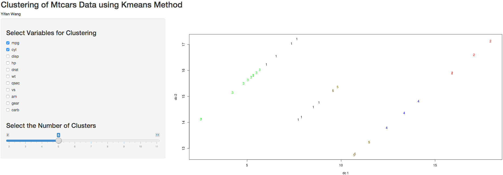

Clustering Data Product Pitch Slides
========================================================
author: Yifan Wang
date: Feb 9, 2016

Clustering Data Product
========================================================


- Direct Link: https://snowneji.shinyapps.io/Mtcars_Clustering/

- Purpose: To perform k-means clustering analysis and visualization without coding

- Package: Shiny

Method
========================================================

- 1. Open the link on the browser
- 2. Select variables to perform the clustering
- 3. Select the number of clusters
- 4. Check the graph for the output


Without the App:
========================================================
- Without the app we have to compare the outputs based on different parameters repeatly like following:


```r
kmd<-kmeans(x = mtcars,centers = 5)
kmd2<-kmeans(x = mtcars,centers = 4) 
```


With the App:
========================================================
- With the app we can play around with parameters interactively:



